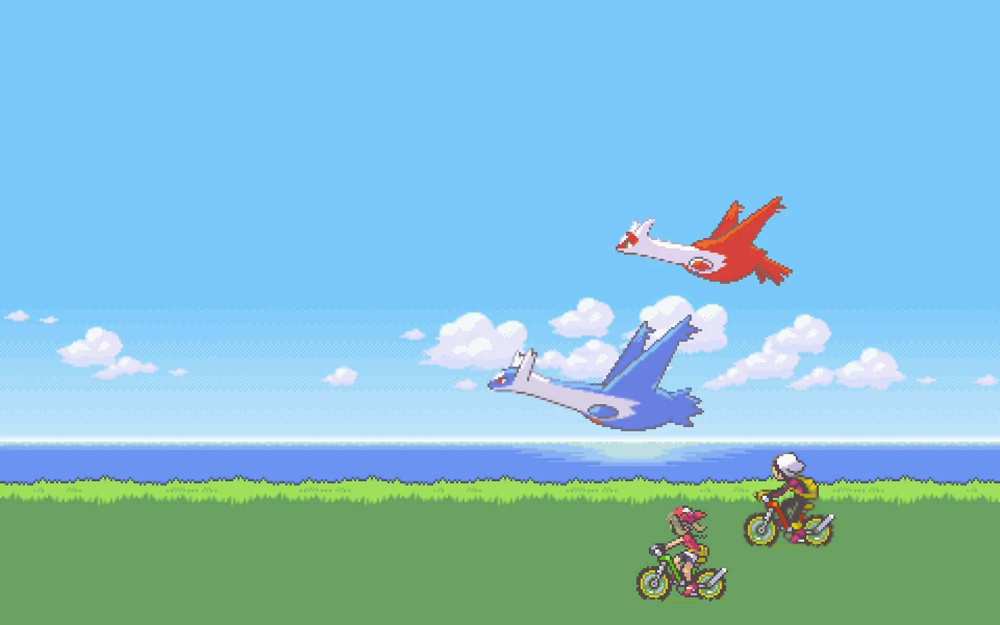
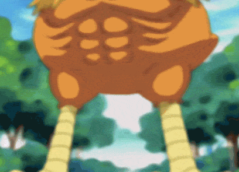

# Pokémon Emerald: The Platform Game
If you want to play the game I made, [click here and Pokémon away my friend](https://besartelezi.github.io/challenge-parallax/).
If you'd rather glue your eyes on to my README and inhale all possible information, then please stay on this page and read away my friend!

## Creating a ~~Paarthurnax~~ Parallax effect
**In short**: I will be creating a platform/endless runner game.
And now in *not so short:*

The goal of this assignment is to create a multi-layered parallax effect, with our own fun little twist on it.
Different layers need to move at different speeds, the first (the ground) is the fastest, while the last layer (the sky) is the slowest.
Images have already been given to us by the coaches, but we're free to create/find our own images if we so desire.
These are the must-have requirements of this assignment.

- A page with a moving background that looks natural
- Something of your personal choosing to enhance the page, go take a look at the suggestions or come up with something yourself!

One of the suggestions the coaches gave us is to create a platform game/endless runner.
And that's precisely what I will be aiming for.

**So in short one more time**: I will be creating a platform/endless runner game.

## To-Do List
- [x] Add basic code structure (HTML, CSS and JS)
- [x] Add all images given to us by coaches
  - [ ] This can be changed later on
- [x] Do some research on the parallax effect
- [x] And some research on the multi-layered parallax effect
- [x] Add favicon
- [x] Big Goal #1: Get images for the Pokémon Game for the Parallax background
  - [x] Grass
  - [x] Clouds
  - [x] Sea
  - [x] Sky
  - [x] Trees (from other Pokémon game)
  - Flying Pokémon
    - Might just add Latios flying, and when it hits something it explodes (Spongebob Style)
  - Once I start in canvas, I need to remember that the pixels of the images are 960 / 600
- [x] Create parallax effect with Pokémon assets
  - [x] Add Canvas in HTML
  - [x] Style Canvas in CSS
  - [x] Start out by just looping/animating one part/one asset
    - [x] This asset needs to keep looping
  - [x] Once one part of parallax is done, do the same for the other parts
  - [x] When parallax effect works -> double check on github if it works properly!
  - [x] Make sure it keeps looping
  - [x] OOP - Create a class called "BackgroundAnimation" (name may be changed in the future)
    - This is needed to give different properties to every 'BackgroundAnimation' object (assets)
- [ ] Get artwork for Pokémon Game
  - [x] Get sprite images of Torchic, Mudkip, and Treecko
    - [ ] If possible, get sprite gif of one of them running
    - https://pokemondb.net/sprites/mudkip
      - [ ] Pokémon Black/White have animated sprites, one where they're also jumping.
      - I can make a sprite sheet of those gifs, one for their idle animation, one for their jumping.
        - This is something would cost a lot of time, time I'd rather spend on figuring out the logic on making the game work instead of looking good.
  - [ ] Get sprite images of other Pokémon that might appear as obstacles
    - [x] Just one Pokémon, once this feature works, add others
    - The User's Pokémon + The Obstacles = Need to be in classes so I can add more in the future
  - [ ] Get sprite images of fire attack, grass attack, and water attack
    - [x] Just one attack sprite, once attacking works, add others
- [x] Add Pokémon on the parallax
  - [x] Create a class to create the Pokémon
  - [x] Add the Pokémon
  - [x] Let the Pokémon move up and down on key button press down
- [ ] Add obstacles
  - [x] Create class Obstacles
  - [x] Create boolean let variable hasLost
  - [x] One of the properties should be 'type'
  - [x] Add Obstacle
  - [ ] Make obstacle move
  - [ ] Create a collision, something must happen when obstacle hits player
    - [ ] According to type of the obstacle, different things happen to the Pokémon
    - [ ] When Pokémon gets hit by obstacle, no matter the typing = (dead)
- [ ] Add Attack functionality
  - [ ] Spacebar = Pokémon Attack
  - [ ] When Pokémon attack type > obstacle Pokémon type = Obstacle removed
  - [ ] When Pokémon attack type <= obstacle Pokémon type = Obstacle still there
- [ ] Add Switch Functionality
  - [ ] Switch between the Pokémon
    - [ ] Different buttons call different Pokémon
    - [ ] A = Grass, Z = Fire and E = Water

## Lettuce Learn Canvas
While doing my research on this assignment (asking questions to Google, a magic 8-ball and my mom who knows nothing about coding), I stumbled upon something called canvas.
Then I found [an interesting video on YouTube](https://www.youtube.com/watch?v=Mg7ibYWhjPI) that delves more into this subject.
I've never used canvas before, so I really want to try it out and learn in during this assignment.

## Name of the game: Pokémon!!
The very first Pokémon game I ever played was Pokémon Emerald.
So I have a strong emotional connection to it.
That's why I chose to create a platform game with a parallax effect using the sprites/art from that game.
During the intro, there was a scene of the main characters riding their bikes with their Pokémon.
I want to use this as background for the parallax effect, and maybe add some other stuff to enhance the parallax experience as well.

I used a free, alternative version to split up all the elements of the image you that I just showed.
It's called [photopea.com](https://www.photopea.com/) and it was a lifesaver!
I do think I might have spent too much time on making it look good and not enough on actually programming, that is something I'm afraid of.
But on the other hand, if it looks cool I can be more proud of it so it was 100% worth it to invest that time in the images.

## Youtube, a blessing and a curse
The video I found helped me out **A LOT** on this assignment.
It might've been working even a bit *too well*.
I feel that if I focus too much on the video and just mindlessly copy pasta of someone on YouTube, I won't learn anything.
That's why I'm forcing myself to comment as much of my Javascript code as possible in this assignment.
The video itself explains everything very thoroughly and I'm definitely learning a lot from it.
But still, just to be 100% entirely sure that I'm actually learning, commenting everything for my own sake is something that is necessary.

## Time to Game
Doritos Dust: Collected. Gaming Gear: Connected. Women: Respected. Oh yeah, It's gamer time!
Now that I have finished the parallax effect on my page, it is (gamer) time to figure out what the game will be and what rules it will have.

Here are a few suggestions:
* You're playing as Latios, flying through the map. You need to dodge everything coming your way (other Pokémon, Pokéballs trying to catch you, Pokémon attacks)
* You're playing as Torchic, Mudkip and Treecko. (You play as just one Pokémon, but you can switch between them)
  * You can dodge Pokémon, you can use fire moves against grass Pokémon to defeat them, so they won't be an obstacle in your way anymore
  * You can't get rid of water type Pokémon
  * The longer the game is continuing on, the bigger the Pokémon will be that start appearing (wailord, kyogre,...)
  * Make it possible to switch between Pokémon, so you can switch between the 3 starters
    * So if you're playing as Torchic (fire type) and all of a sudden a Squirtle appears (water type, you can switch to Treecko (a grass type) and defeat the Squirtle instead of doding it
  * Add a Point system per Pokémon defeated
    * Add Shiny Pokémon chance, shinies are worth 10x more points as normal
  * EVOLUTION, once you have a certain amount of points, your Pokémon evolve, first Treecko, then Mudkip, and then Torchic
    * Evolved Pokémon move faster + attack faster
  * Add normal type obstacles
    * Player can't defeat them, these need to be dodged
  * Different Pokémon = different sized obstacles
    * Snorlax = big and slow
    * Linoone, mediumsized and very fast
    * Charizard = big and can move up and down randomly

After writing everything out, I came to the conclusion that making the Latios game might be easier, making the 3 starters game would be WAAAAAAAAAAAAAAAAAAAAAAAAAAAAAAAAAAAAAAAAAAAAAAAAAAAAAAAAAAAAAAAAAAAAAAAAAAAAAAAAAAAAAAAAAAAAAAAAAAAAAAAAAAAAAAAAAAAAAAAAAAAAAAAAAAAAAAAAAAAAAAAAAAAAAAAAAAAAAAAAAY more fun.
And thus, I shall be trying to create the Pokémon Emerald: Starters Adventure game.

